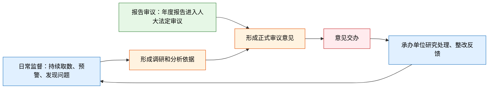

以人大为监督主体的“国有资产管理情况**报告审议监督**”系统。

# 流程

整体服务以人大为主体进行。
报告审议：年度正式监督流程。
日常监督：平时持续发现、跟踪问题的监督流程。

**日常监督负责“发现问题和证据”；报告审议负责“依法审议、形成意见”；交办反馈负责“推动整改、检验成效”**

## 日常监督

### 台账
此模块主要作用为，国资监督的账簿，监控预警，问题跟踪。

| 台账类型 | 含义              | 主要作用                            |
| ---- | --------------- | ------------------------------- |
| 数据台账 | 国资报表和数据报送记录     | 检查数据是否报齐、是否完整、保证监督的数据可靠完整。      |
| 资产台账 | 各类国有资产的分类底账     | 资产规模、结构、分布和变化情况，可多维度穿透查看        |
| 指标台账 | 经营、财务和风险指标的监测清单 | 通过预警规则 识别风险并预警。                 |
| 问题台账 | 审计、检查、分析发现的问题清单 | 固化问题，跟踪来源、涉及单位、问题性质和风险。方便后续追踪溯源 |
| 整改台账 | 问题处理和整改记录       | 跟踪负责单位、问题状态，确保发现问题，改正问题。        |

### 报告生成

日常的对于国有资产的 调研，分析，评价报告生成，爱辅助

### 意见交办

