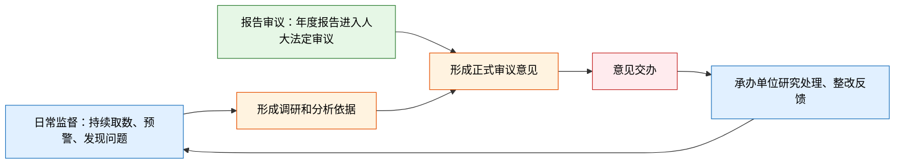
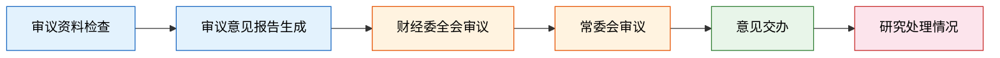

以人大为监督主体的“国有资产管理情况**报告审议监督**”系统。

# 流程

整体服务以人大为主体进行。
报告审议：年度正式监督流程。
日常监督：平时持续发现、跟踪问题的监督流程。

**日常监督负责“发现问题和证据”；报告审议负责“依法审议、形成意见”；交办反馈负责“推动整改、检验成效”**

## 日常监督

### 台账
此模块主要作用为，国资监督的账簿，监控预警，问题跟踪。

| 台账类型 | 含义              | 主要作用                            |
| ---- | --------------- | ------------------------------- |
| 数据台账 | 国资报表和数据报送记录     | 检查数据是否报齐、是否完整、保证监督的数据可靠完整。      |
| 资产台账 | 各类国有资产的分类底账     | 资产规模、结构、分布和变化情况，可多维度穿透查看        |
| 指标台账 | 经营、财务和风险指标的监测清单 | 通过预警规则 识别风险并预警。                 |
| 问题台账 | 审计、检查、分析发现的问题清单 | 固化问题，跟踪来源、涉及单位、问题性质和风险。方便后续追踪溯源 |
| 整改台账 | 问题处理和整改记录       | 跟踪负责单位、问题状态，确保发现问题，改正问题。        |

### 报告生成

日常的对于国有资产的 调研，分析，评价报告生成，（ai辅助)

### 研究处理情况

（之前的环节中）**发现问题** →（意见交办）**提出意见 → 交办单位** →（研究处理情况）**办理反馈 → 跟踪办结**
#### 意见交办
**日常监督意见交办侧重“及时发现、及时处置”**
日常督办,将发现的问题交由责任单位办理，推动风险处置和整改，为了**解决**发现的问题。

#### 研究处理情况
**落实跟踪模块。它用于记录单位如何办理、整改、是否按时反馈**
记录承办单位对交办意见的研究、整改和落实情况

## 报告审议

**总结**：日常监督是“平时管”，报告审议是“集中议”。前者发现问题，后者形成正式意见并推动落实。

|     | 日常监督           | 报告审议            |
| --- | -------------- | --------------- |
| 做什么 | 平时看数据、预警、问题和整改 | 集中审议政府国资报告      |
| 目的  | 早发现、早处理问题      | 形成正式审议意见并交办     |
| 关系  | 为报告审议提供数据和问题依据 | 对重大共性问题提出正式监督要求 |

## 报告审议

报告审议是人大对政府国有资产管理情况报告开展集中、正式监督的流程。  
目的是将日常监督发现的问题，结合政府年度报告，形成正式审议意见并推动整改落实。

### 审议资料检查

**确保审议资料齐全、可用。**
上传并确认相关资料。  只有资料完整确认后，才进入后续审议流程。
资料应来源于日常监督的问题发现和预警。

### 审议意见报告生成

**将报告和日常监督发现的问题，转化为审议意见。**
此为人大环境的意见报告生成，因为这个是针对人大的系统。

### 财经委全会审议

**专业初审，完善审议意见。**
财经委委员围绕报告和审议意见提出专业意见，系统收集委员意见并形成财经委全会审议稿、定稿。

### 常委会审议

**形成正式、权威的审议意见。**
常委会委员审议财经委全会定稿，提出意见后形成常委会审议定稿。  
该定稿是后续正式交办的依据。

### 意见交办

**将正式审议意见交由责任单位办理。**

根据常委会审议定稿，生成交办函，明确主送单位、办理要求和反馈期限。  
报告审议意见交办侧重“依法审议、正式交办”。

### 研究处理情况

**跟踪正式审议意见是否落实。**

承办单位对交办意见进行研究、整改并上传反馈材料；系统记录反馈日期、办理状态和相关文件，持续跟踪至办结。

### 总结

**审议资料检查 → 形成审议意见 → 财经委初审 → 常委会正式审议 → 意见交办 → 整改反馈**

报告审议将日常监督成果转化为正式监督意见，并通过交办和研究处理情况，推动国有资产管理问题整改落实。