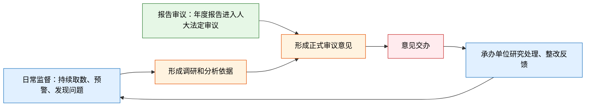

以人大为监督主体的“国有资产管理情况**报告审议监督**”系统。

# 流程

整体服务以人大为主体进行。
报告审议：年度/届期的法定、正式监督流程。
日常监督：平时持续发现、跟踪问题的常态化监督流程。

```mermaid
flowchart LR
  A["日常监督：持续取数、预警、发现问题"] --> C["形成调研和分析依据"]
  B["报告审议：年度报告进入人大法定审议"] --> D["形成正式审议意见"]
  C --> D
  D --> E["意见交办"]
  E --> F["承办单位研究处理、整改反馈"]
  F --> A

  classDef blue fill:#e1f0ff,stroke:#1e73be,color:#000
  classDef green fill:#e6f7e6,stroke:#2e7d32,color:#000
  classDef orange fill:#fff3e0,stroke:#e65100,color:#000
  classDef red fill:#ffebee,stroke:#c62828,color:#000

  class A blue
  class B green
  class C,D orange
  class E red
  class F blue
```

